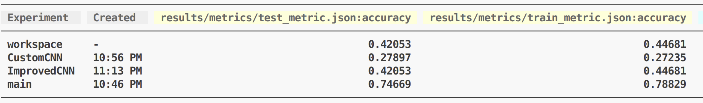

# Задача: классификация по изображениям жуков их вида. 

**Всего имеется 4 вида жуков: долгоносик, усач, хищник, носорог**

1. Загрузка датасета
    Датасет скачивается при помощи downloader.py, он встроен в pipeline \\
    url на изображения находтся в csv для соответствующего класса в папке metadata

2. Модели
    Експерименты в каждой ветки отличаются использованием разных моделей: Resnet18, CustomCNN, ImprovedCNN \\
    в каждой ветки в папке `models` находится соответствующая модель

3. Результаты
    Все результаты для каждого эксперимента приведены в папке `results` \\
    В папке `metrics` находятся json c accurancy для train и test каждой модели

4. notebook
    В папке `notebook` находится файл `main.ipynb`, в котором представлен полный цикл обучения и тестирования моделей

